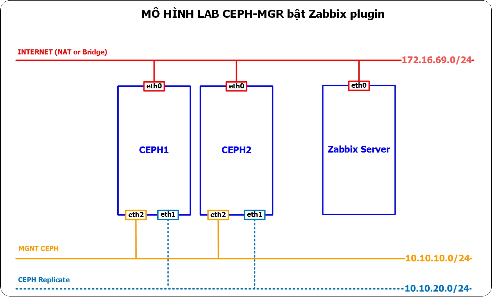
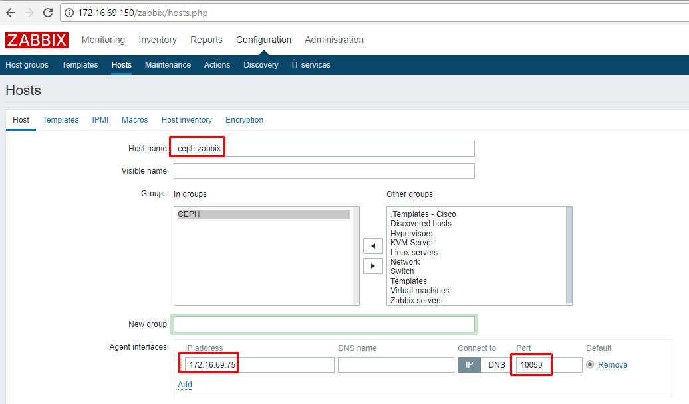
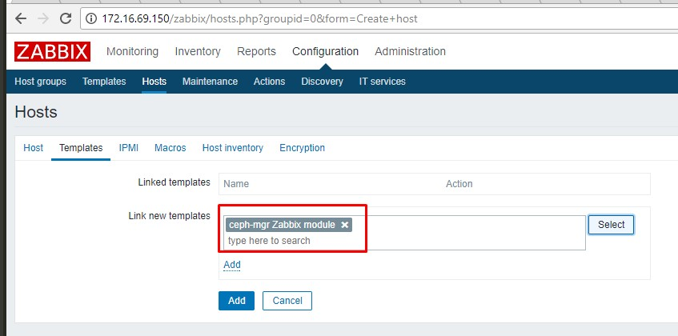
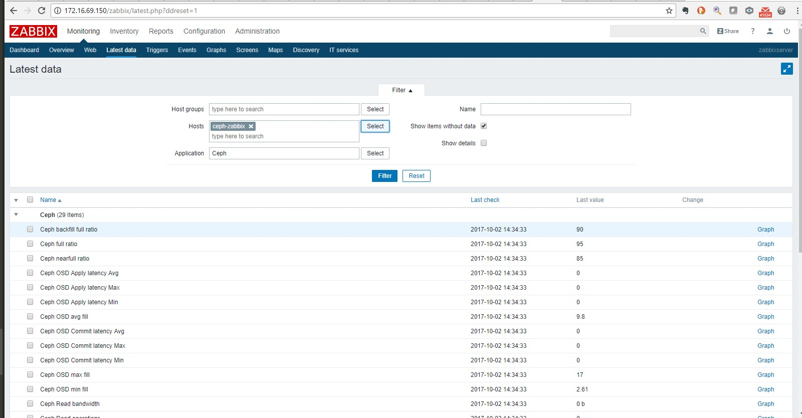

## Hướng dẫn cài đặt thành phần ceph-mgr trên bản Luminous

## Mô hình 
- Sử dụng mô hình


## IP Planning
- Phân hoạch IP cho các máy chủ trong mô hình trên


## Chuẩn bị và môi trường LAB
- Ceph cluster đã cài đặt thành công theo hướng dẫn: https://github.com/longsube/ghichep-CEPH-1/blob/master/docs/ceph-deploy-lumious-CentOS7.4.md
 - Một host Zabbix Server

### Chú ý
Đã cài đặt Ceph theo hướng dẫn ở link [sau](2.ceph-deploy-lumious-CentOS7.4.md)

Ceph-mgr là một thành phần mới của Ceph (xuất hiện từ bản Luminous), chịu trách nhiệm cho việc mirror dữ liệu giữa các ceph cluster và quản lý tài nguyên của Ceph Cluster. Có thể cài đặt Ceph-mgr daemon trên nhiều host, hoạt động theo cơ chế active-passive.

## Thực hiện trên host ceph1 

- Cài đặt ceph-mgr trên ceph1
```sh
ceph-deploy mgr create ceph1
```
- Kiểm tra trạng thái của ceph-mgr bằng `ceph -s`
```sh
ceph-deploy@ceph1:~$ ceph -s
  cluster:
    id:     36bb6bc0-5f0d-4418-b403-2d4ca22779a2
    health: HEALTH_OK
 
  services:
    mon: 3 daemons, quorum ceph1,ceph2,ceph3
    mgr: ceph1(active)
    osd: 3 osds: 2 up, 2 in
 
  data:
    pools:   0 pools, 0 pgs
    objects: 0 objects, 0 bytes
    usage:   2132 MB used, 79585 MB / 81717 MB avail
    pgs:     
```
Chú ý dòng `mgr: ceph1(active)`, ceph-mgr daemon trên host ceph1 đã active

- Ceph-mgr hỗ trợ dashboard để quan sát trạng thái của cluster, Enable mgr dashboard trên host ceph1
```sh
ceph mgr module enable dashboard
```

- Truy cập vào mgr dashboard để kiểm tra


Ceph-mgr hỗ trợ gửi thông tin trạng thái cluster ra các hệ thống giám sát bên ngoài như: zabbix, prometheus, Restful API,... Hướng dẫn sau sẽ thực hiện việc enable zabbix plugin

- Trên host chạy ceph-mgr, cần cài đặt module zabbix_sender
  ```sh
  rpm -Uvh http://repo.zabbix.com/zabbix/3.0/rhel/7/x86_64/zabbix-release-3.0-1.el7.noarch.rpm
  yum install zabbix-sender -y
  ```
- Enable zabbix module cho ceph-mgr
  ```sh
  ceph mgr module enable zabbix
  ```
- Cấu hình ceph-mgr để đẩy thông tin tới zabbix server, sử dụng lệnh sau để list các thông số có thể cấu hình:
  ```sh
  ceph config-key ls
  ```
  Kết quả:
  ```sh
  [
    "mgr/zabbix/identifier",
    "mgr/zabbix/interval",
    "mgr/zabbix/zabbix_host",
    "mgr/zabbix/zabbix_port",
    "mgr/zabbix/zabbix_sender"
  ]
  ```
  Trong đó:
  *mgr/zabbix/identifier*: khai báo tên của source đẩy metric, tên này cần phải trùng với thông số Host được khai báo trên zabbix server
  *mgr/zabbix/interval*: khai báo khoảng thời gian đẩy metric lên zabbix server (mặc định là 60s)
  *mgr/zabbix/zabbix_host*: khai báo IP hoặc domain name của zabbix server
  *mgr/zabbix/zabbix_port*: khai báo port zabbix_sender sử dụng (mặc định 10050)
  *mgr/zabbix/zabbix_sender*: khai báo đường dẫn thực thi của zabbix_sender (mặc định là /usr/bin/zabbix_sender)

  Trong bài lab này, ta sẽ cấu hình các thông số zabbix_host và identifier, các thông số còn lại giữ mặc định
  ```sh
  ceph config-key set mgr/zabbix/zabbix_host 172.16.69.150
  ceph config-key set mgr/zabbix/identifier  ceph-zabbix
  ```

## Thực hiện trên zabbix server
- Download zabbix template tại: https://raw.githubusercontent.com/ceph/ceph/luminous/src/pybind/mgr/zabbix/zabbix_template.xml
- Trên zabbix server, vào **Configuration > Template**, lựa chọn **Import**, Chọn đường dẫn tới zabbix template vừa tải về, và import. Tên của template được import là *ceph-mgr Zabbix module*.


- Vào **Configuration > Host**, khai báo các thông số như hình, chú ý Host name phải trùng với identifier khai báo cho ceph-mgr


- Chuyển sang tab **Templates**, link tới template *ceph-mgr Zabbix module* vừa tạo, chọn **Add**


- Vào **Monitoring > Latest Data**, chọn host *ceph-zabbix*, sẽ thấy các metric của cluster đã được đẩy về



