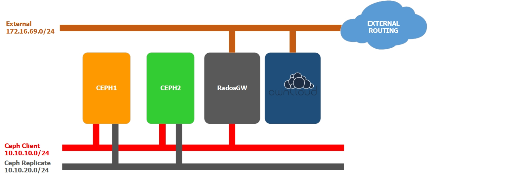
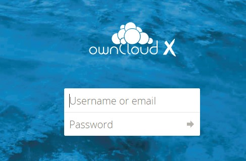
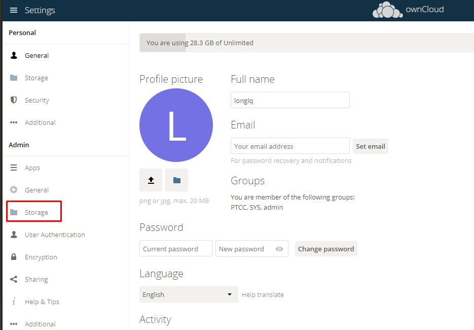
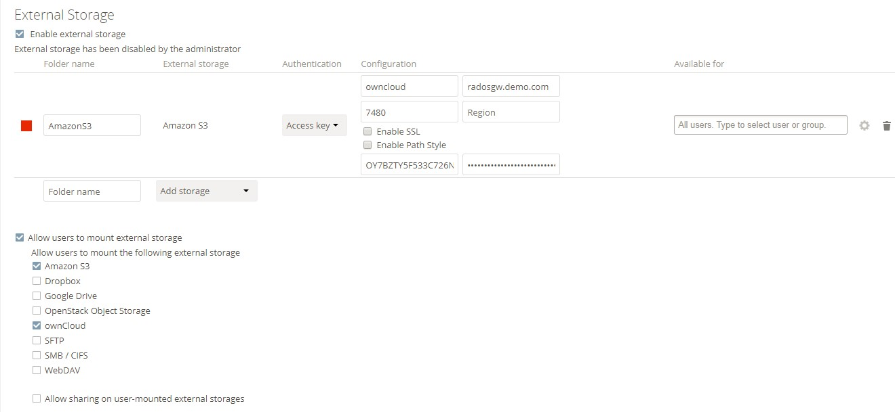

# Hướng dẫn cài đặt và cấu hình RadowGW, tích hợp với OwnCloud
******

# I. Cài đặt cơ bản
******

## 1. Chuẩn bị môi trường

### 1.1 Mô hình mạng
- Mô hình đầy đủ



 
### Chú ý

Đã cài đặt Ceph theo hướng dẫn ở link [sau](2.ceph-deploy-lumious-CentOS7.4.md)

## 2. Thực hiện trên ceph 1

### 2.1. Sửa file `/etc/hosts` của tất cả các host ceph như sau:
```
10.10.10.75 ceph1
10.10.10.76 ceph2
10.10.10.73 radosgw
```

### 2.2. Cấu hình /etc/ceph/ceph.conf trên từng host
- Thêm các dòng cấu hình radosgw sau ở cuối file, lưu ý thay đổi tên host tương ứng
	```sh
	[client.rgw.gatewaygw]
	host = radosgw
	rgw socket path = /var/run/ceph/ceph.radosgw.gateway.fastcgi.sock
	log file = /var/log/radosgw/client.radosgw.gateway.log
	rgw dns name = radosgw.demo.com
	rgw print continue = false
	rgw keystone token cache size = 0
	rgw keystone revocation interval = 0
	```

### 2.3. Chuyển ceph.conf từ host ceph1 sang host ceph radosgw
```
scp /etc/ceph/ceph.conf  root@radosgw:/etc/ceph/ceph.conf
```

### 2.4. Chuyển ragosgw keyring từ host ceph1 sang host ceph radosgw
```
scp ceph.client.radosgw.keyring radosgw:/etc/ceph
```

## 3. Thực hiện trên từng host ceph RadosGW

### 3.1. Update repo 
Tại `/etc/yum.repos.d/ceph-luminous.repo`

```
[c7-ceph]
name=Ceph Aliyun for Enterprise Linux 7 - $basearch
baseurl=https://download.ceph.com/rpm-luminous/el7/x86_64/
enabled=1
gpgcheck=0
gpgkey=file:///etc/pki/rpm-gpg/RPM-GPG-KEY-EPEL-7

[c7-ceph-deploy]
name=Ceph-deploy for Enterprise Linux 7 - $basearch
baseurl=https://download.ceph.com/rpm-luminous/el7/noarch/
enabled=1
gpgcheck=0
gpgkey=file:///etc/pki/rpm-gpg/RPM-GPG-KEY-EPEL-7
```

Tại `/etc/yum.repos.d/epel-7.repo`

```
[epel]
name=Extra Packages for Enterprise Linux 7 - $basearch
baseurl=http://mirrors.aliyun.com/epel/7/$basearch
        http://mirrors.aliyuncs.com/epel/7/$basearch
#mirrorlist=https://mirrors.fedoraproject.org/metalink?repo=epel-7&arch=$basearch
failovermethod=priority
enabled=1
gpgcheck=0
gpgkey=file:///etc/pki/rpm-gpg/RPM-GPG-KEY-EPEL-7
 
[epel-debuginfo]
name=Extra Packages for Enterprise Linux 7 - $basearch - Debug
baseurl=http://mirrors.aliyun.com/epel/7/$basearch/debug
        http://mirrors.aliyuncs.com/epel/7/$basearch/debug
#mirrorlist=https://mirrors.fedoraproject.org/metalink?repo=epel-debug-7&arch=$basearch
failovermethod=priority
enabled=0
gpgkey=file:///etc/pki/rpm-gpg/RPM-GPG-KEY-EPEL-7
gpgcheck=0
 
[epel-source]
name=Extra Packages for Enterprise Linux 7 - $basearch - Source
baseurl=http://mirrors.aliyun.com/epel/7/SRPMS
        http://mirrors.aliyuncs.com/epel/7/SRPMS
#mirrorlist=https://mirrors.fedoraproject.org/metalink?repo=epel-source-7&arch=$basearch
failovermethod=priority
enabled=0
gpgkey=file:///etc/pki/rpm-gpg/RPM-GPG-KEY-EPEL-7
gpgcheck=0
```

Update
```
yum update -y
```

### 3.2. Cài đặt radowgw cho host Radosgw, thực hiện trên host ceph deploy (ceph1)


```
su - ceph-deploy
[ceph-deploy@ceph1 ~] cd cluster-ceph
[ceph-deploy@ceph1 ~] ceph-deploy install --rgw --release luminous radosgw
```

### 3.3. Tạo RadosGW
```
[ceph-deploy@ceph1 ~] ceph-deploy rgw create radosgw
```

Sau bước này user client.rgw.radosgw sẽ được tạo ra, từ bản luminous đây sẽ là user được sử dụng để giao tiếp với ceph.

Lệnh để kiểm tra socket của radowgw:

```
ceph --admin-daemon /var/run/ceph/ceph-client.rgw.radosgw.asok config show | grep dns
```

Kết quả trả về phải như sau:

```
"mon_dns_srv_name": "",
"rgw_dns_name": "radosgw.demo.com",
"rgw_dns_s3website_name": "",

```

### 3.4. Kiểm tra webserver civetweb
```
ps -ef | grep radosgw 
netstat -nplt | grep 7480
```

### 3.5. Kiểm tra user radosgw có thể truy cập vào ceph cluster
```
ceph -s -k /etc/ceph/ceph.client.radosgw.keyring --name client.radosgw.gateway
```
Kết quả:
```
  cluster:
    id:     d2281eb5-93fe-4f45-854e-76cfb4989254
    health: HEALTH_WARN
            too many PGs per OSD (576 > max 300)
 
  services:
    mon: 1 daemons, quorum ceph1
    mgr: ceph1(active)
    mds: cephfs-1/1/1 up  {0=ceph2=up:active}
    osd: 4 osds: 4 up, 4 in
    rgw: 1 daemon active
 
  data:
    pools:   11 pools, 1152 pgs
    objects: 4317 objects, 31475 MB
    usage:   74855 MB used, 85970 MB / 157 GB avail
    pgs:     1152 active+clean
```

### 3.6. Tạo user longlq cho S3 service
```
radosgw-admin user create --uid="longlq" --display-name="Quang Long" --email=longsube@gmail.com -k /etc/ceph/ceph.client.radosgw.keyring --name client.radosgw.gateway
```
Kết quả:
```
{
    "user_id": "longlq",
    "display_name": "Quang Long",
    "email": "longsube@gmail.com",
    "suspended": 0,
    "max_buckets": 1000,
    "auid": 0,
    "subusers": [],
    "keys": [
        {
            "user": "longlq",
            "access_key": "OY7BZTY5F533C726N2RW",
            "secret_key": "PIo7gChV3xGRq6IpDKdiG1VUKL6w3vF7alXqbZuz"
        }
    ],
    "swift_keys": [],
    "caps": [],
    "op_mask": "read, write, delete",
    "default_placement": "",
    "placement_tags": [],
    "bucket_quota": {
        "enabled": false,
        "max_size_kb": -1,
        "max_objects": -1
    },
    "user_quota": {
        "enabled": false,
        "max_size_kb": -1,
        "max_objects": -1
    },
    "temp_url_keys": []
}
```


### 3.7. Cấu hình Private DNS trên host RadosGW
 
 - Cài đặt gói bind
 	```
 	yum install bind* -y
 	```

 - Sửa file /etc/named.conf
	```
	# Thu muc mac dinh chua cac zone file
	directory "/var/cache/bind";
	# Cau hinh dich vụ DNS cua host radosgw (172.16.69.73) su dung port 53
	listen-on port 53 { 127.0.0.1;172.16.69.73; };
	# Cau hinh dai mang cho phep query DNS
    allow-query      { localhost;172.16.69.0/24; };

 - Sửa file /etc/named.conf
 	```
 	# Them zone cho domain "demo.com"
 	zone "demo.com" IN {
		type master;
		file "db.demo.com";
		allow-update { none; };
	};
 	```
 - Tạo zone file db.demo.com tại thư mục /var/named
 	```
 	@ 86400 IN SOA demo.com. root.demo.com. (
        20091028 ; serial yyyy-mm-dd 
        10800 ; refresh every 180 min 
        3600 ; retry every hour
        3600000 ; expire after 1 month + 
        86400 ); min ttl of 1 day
	@ 86400 IN NS demo.com.
	@ 86400 IN A 172.16.69.73
	* 86400 IN CNAME @
 	```
 - Khởi động lại dịch vụ bind
 	```
 	systemctl start named.service
 	```

### 3.7. Test:
```
named-checkzone demo.com /var/named/db.demo.com
```

Kết quả:
```
zone demo.com/IN: loaded serial 20091028
OK
```

```
nslookup longlq.demo.com
```

Kết quả:
```
Server:         172.16.69.73
Address:        172.16.69.73#53
```

## 4. Thực hiện trên host Owncloud

### 4.1. Cài đặt Owncloud
Thực hiện theo hướng dẫn tại [đây](https://github.com/longsube/ghichep-owncloud/blob/master/docs/Caidat_OwnCloud10.md)

### 4.2. Cài đặt s3cmd
```
yum install -y s3cmd
```

### 4.3. Cấu hình các thông số của s3cmd, thực hiện theo các bước được hướng dẫn, chú ý thay đổi access key và secret key của user longlq
```
s3cmd --configure
```

### 4.4. Lệnh trên sẽ sinh ra file /root/.s3cfg, sửa file đó và thêm vào host_base và host_bucket của S3
```
host_base = radosgw.demo.com:7480
host_bucket = %(bucket)s.radosgw.demo.com:7480
```

### 4.5. Sửa /etc/resolv.conf để dùng DNS của Radosgw
```
search demo.com
nameserver 172.16.69.73
```

### 4.6. Thử S3 API
- Tạo bucket trên S3
 	```
 	s3cmd mb s3://owncloud
 	```
 - List bucket
 	```
 	s3cmd ls
 	```

### 4.7. Thêm Ceph làm Storage cho Owncloud

- Login vào `http://172.16.69.71/owncloud` bằng tài khoản có quyền admin



- Lựa chọn mục Storage



- Khai báo các thông tin về External Storage



Trong đó:
 - Folder name: đặt tên cho folder sử dụng Ceph Storage.
 - Configuration: khai báo
 	+ owncloud: bucket trên Ceph đã tạo ở bước trên.
 	+ radosgw.demo.com: domain của Ceph radosgw
 	+ 7480: port của web server của RadosGW (civetweb)
 - Access key: khai báo:
 	+ HN: region bất kỳ
 	+ Lựa chọn Enable path style
 	+ Khai báo Access key và Secret key của user S3
 - Available for: khai báo các user owncloud được phép truy cập vào storage này.

 - Lựa chọn *Allow users to mount external storage* và chọn **Amazon S3**

 _ Kiểm tra việc upload dữ liệu vào thư mục Ceph-S3
 


Tham khảo:

[1] - http://blog.csdn.net/for_tech/article/details/51098251

[2] - http://blog.csdn.net/for_tech/article/details/77188121